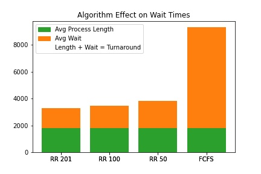
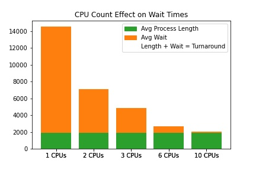
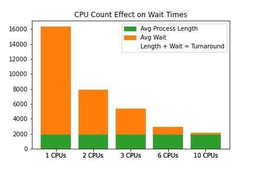
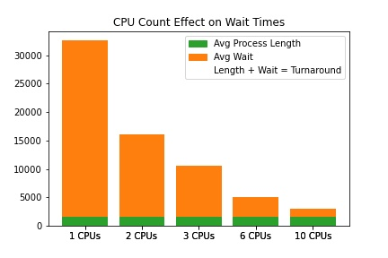
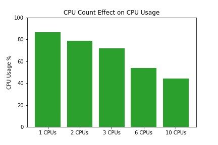
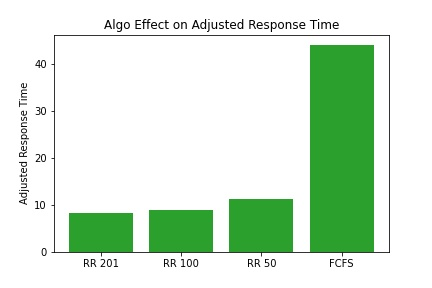

# Benchmarking Report

## Assumptions

### System Architecture
 - All CPUs are created equal and independent
 - No one process is reliant on any other (Independent Granularity)
 - The IO usage of one process does not effect the IO experience of another

### System Timing
 - Every part of the system functions on a single clock. Every task completes after some integer number of Steps (i.e. clock ticks)
 - Switching between processes (including terminating the current process, scheduling the next process, and swapping contexts) always takes a constant amount of time and is executed entirely on the CPU which is swapping processes
 - While a CPU is swtiching a process in/out, neither the CPU nor the process can perform productive work

### Process Lifetime
 - Processes alternate between completing instructions on the CPU and waiting for IO operations
 - The time a process enters the system and the number of steps required for all of its CPU and IO bursts are predetermined at the start of the simulation
 - Processes can be swapped out immediately at any point in their CPU burst
 - No process spawns another process (changing the execution timing of one process will not effect the arrival time of another)

### Process Ready Queueing
 - Each process will be assigned a constant priority
 - In the ready queue, a process will be placed into a queue corresponding to its priority
 - Highest priority queues will always be prioritized over lower priority queues
 - Individual queues will serve processes on a FCFS basis (you know, like a queue)
 - NOTE: the ReadyPriorityQueue class is designed such that the priotizing strategy could change without effecting the class interface. However, changing the strategy could invalidate certain design assumptions made elsewhere in the simulation, so it should only be done with caution.

### Timing Ratios
 - Under this simulation, IO operations take singificantly more time than processor execution, context switching is relatively costly, and the distribution of burst length is linear. These simplifications surely had effects on the final results. The most subtle assumption is the lack in significant variation between program lengths. There are no intentionally lengthy or intentionally brief programs or massive chunks of computation. In reality, a higher variance of process length would likely alter the results in unexpected manners.
 - Numbers
   - Process length
     - CPU Bursts are a random number of steps from 1 to 200
     - IO Bursts are a random number of steps from 1 to 500
   - CPU Context Switching
     - Switching in a process takes 7 steps
     - Switching out a process takes 3 steps

## Graphs

### Throughput and Wait
Each graph compares the wait time of different setups. The average wait time is in orange, stacked on top of the average process length in green. Together, the bar represents the turnaround time. Because, in each comparison, all setups act simulate the same set of processes, the ratio of turnaround times is directly proportional to the ratio of throughput.

Under this simulation, Round Robin scheduling is far superior to First Come First SErved scheduling in terms of decreasing wait and increasing throughput. Furthermore, longer Round Robin time quantums proved to be more favorable. In fact, a Round Robin of 201 steps (1 longer than the maximum length of CPU burst) is best of all. This means the ideal strategy is to never interrupt a process's CPU time, but to swap it out when its time is up.

Across all algorithms, we see that more cpus yield lower wait and higher throughput.

|Setup|Chart|
|--|--|
|RR 201||
|RR 100||
|RR 50||
|FCFS||

However, examining CPU usage percentages suggests that systems with lower CPU counts may make more efficient use of their more limited processors.

### Response Time
I define "Response Time" as the maximum interval between IO bursts. For a particular process, "Adjusted Response Time" is calculated as Response Time divided by the longest CPUBurst of that process. In other words, Adjusted Response Time represents how much longer a user must wait between IO activity than they would have had to wait if the process executed as quickly as possible. Here, the pattern looks the same as throughput, wait, and turnaround, Round Robin is significantly better than First Come First Served and (although I won't include another table of charts here) higher CPU counts are better than lower.

